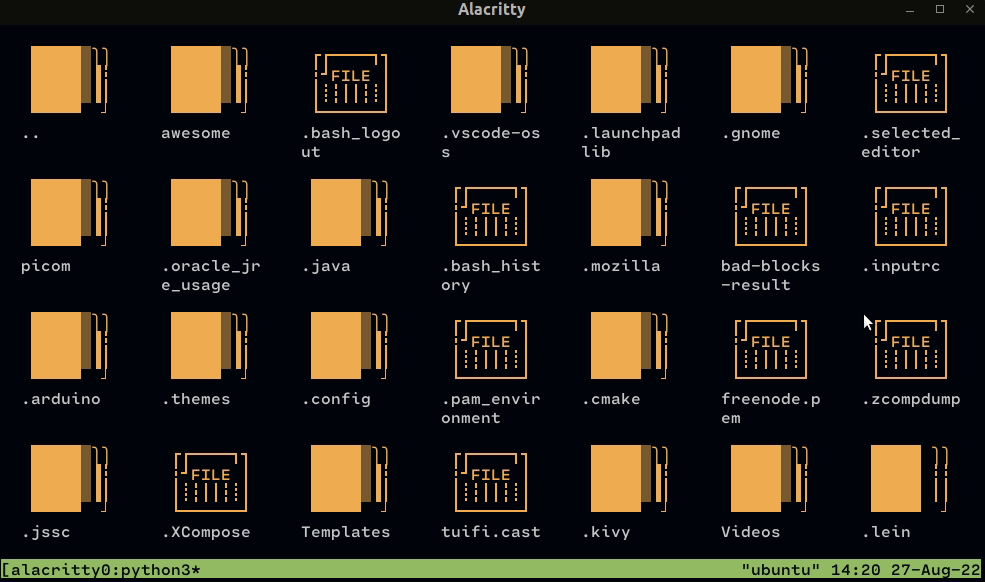
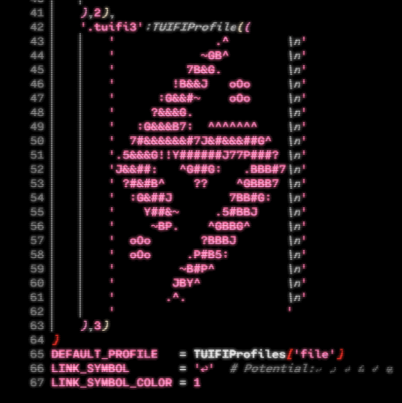

<div align="center">
<h1>TUIFI Manager</h1>
<p>
    <a href="https://github.com/GiorgosXou/TUIFIManager/pulse">
      
    </a>
    <a href="https://github.com/GiorgosXou/TUIFIManager/blob/master/LICENSE.md">
      
	</a>
</p>
</div>

A cross-platform terminal-based termux-oriented file manager *(and component)*, meant to be used with a [Uni-Curses](https://github.com/unicurses/unicurses) project or as is. This project is mainly an attempt to get more attention to the [Uni-Curses](https://github.com/unicurses/unicurses) project.


## Installation
```terminal
sudo pip3 install tuifimanager --upgrade
```
```terminal
pip3 install TUIFIManager --upgrade
```
or just ^^^ if it works for you. *(eg. on termux?)*


## Usage
Run `tuifi` in your terminal to use it as is or import it in one of your [Uni-Curses](https://github.com/unicurses/unicurses) project as a component like:
```python
from TUIFIManager import *
```
for more details look into the `__main__.py`


<sub>FONT: Cartograph CF</sub>

## Features & Shortcuts  
### *Current:*
* Supports most of the common mouse events so far
* It is somewhat fully customizable?
* Can be used as a component
* Uses only ~30MB of RAM
* It is pretty snappy <!-- Kinda lol -->
* Supports [Termux](https://github.com/termux) 
* Cross Platform 
* and more

### *Desired:*
* Undo\Redo
* tool-tips
* Scroll bar
* Multiple tabs
* Better performance
* Effect on cutted Files
* [Drop files into GUI apps](https://github.com/GiorgosXou/TUIFIManager/issues/21)

### *Common Shortcuts\Keybindings*
In `vim_mode` both normal and vim shortcuts work 
| Normal      | vim_mode | Action                                        |
|----         | ---- |:----                                          |
|`SHIFT + TAB`  |   |Moves selected file to the previous directory |
|`KEY_BACKSPACE`| `J` |Opens\Goes to the previous directory          |
|`ALT + DOWN`   |   |Opens\Closes the "right-click menu"           |
|`KEY_HOME`     | `H`  |Navigates to the $HOME directory              |
|`KEY_F5`       |   |Reload\Refresh current directory              |
|`CTRL + V`     | `p` |Pastes the Copied or Cuted files              |
|`DEL`          | `CTRL+d`  |Deletes the selected files                    |
|`CTRL + F`     | `i`  |Find Files *(if not auto_find_on_typing)*     |
|`CTRL + O`     | `O`  |Open whole directory in editor                |
|`CTRL + C`     | `yy`  |Copies the selected files                     |
|`CTRL + K`     |   |Copies the selected files                     |
|`CTRL + X`     | `c`  |Cuts the selected files                       |
|`CTRL + R`     | `r` |Rename selected file                          | 
|`CTRL + N`     | `W` |Create new folder                             |
|`CTRL + W`     | `w` |Create new file                               |
|`ARROW KEYS`   | `l` `k` `j` `h`  |Navigates files                               |
|`KEY_ENTER`    | `K`|Opens files                                   |
|`ESCAPE`       |   |Exit                                          |


### *TERMUX only Shortcuts\Keybindings*
| Shortcut    | Action                                                                         |
|----         |:----                                                                           |
|`CTRL + DOWN`| Goes in&out of select-mode while also automatically copies the selected file(s)|
|`CTRL + LEFT`| Goes out of select-mode while also cuts the seleccted file(s)                  |
|`CTRL + END` | Goes out of select-mode while also deleting the selected file(s)               |
|`CTRL + UP`  | Same as `CTRL + V`, Pastes the Copied or Cuted files                           |
|`END`        | Deletes selected files                                                         |


### *Default & Custom - Commands*
To perform a command under the normal-mode, you first have to press the space-bar and then type the command. Alternatively, use `vim_mode` or enable the `tuifi_auto_command_on_typing`-env variable *(notice: it disables `tuifi_auto_find_on_typing`)*. **The default commands can be seen below and can be found under the `~/.config/tuifi/cmds.conf` where you can add your custom ones too:**

| Cmd | Type | Attributes | Label Comment|
|---|---|---|---|
|`gt` | open | 'directory':'~/.config/tuifi'           | - tuifi -|
|`gh` | open | 'directory':'~/'                        | - Home -|
|`owv` | open | 'directory':None,'\_with':'vim'         |Opened With Vim|
|`yat` | copy | 'pattern':'.+\.txt'                     ||
|`yy` | copy | 'pattern':None                          ||

There are also some "static" ones like the `m`+character which marks the current directory into the character, so you can navigate back to it by using \` or `;`+that_character 


# Documentation
<sub>Work in progress 🛠️🏗 ...</sub>


## Customization 
***How do I enable vim_mode?***
> Set `tuifi_vim_mode` enviroment variable to `True`

***How do I map keys in vim_mode?***
> This ain't possible right now althought you could play around with the content of `toggle_vim_mode` function under `__init__.py`

***How do I set the default editor?***
> Set `tuifi_default_editor` enviroment variable to `vim` or whatever you prefer

***How do I disable the auto-find-mode?***
> You can just set `tuifi_auto_find_on_typing` enviroment variable to `False`

***How do I change the default configuration path?***
> Set `tuifi_config_path` enviroment variable to whatever you prefer most

***How do I toggle hidden files/folders?***
> Edit `__main__.py` and specify `suffixes=['*','.*']` for hidden files. [THIS NEEDS TO BE FIXED]

***How do I change the default colors?***
> [look here for more informations](https://github.com/GiorgosXou/TUIFIManager/issues/38)


# Donation
I do really need money to survive, I have no job, living in a basement, making things for free, because I love to.
- [***Paypal Address***](https://www.paypal.com/donate/?hosted_button_id=QNQN23M55EJVS)
- ***Monero Address:*** `897ehhSQJQpGF7tYDhQM51jiX7nnHmzuYAW4q8JGwJxu8JKXvaK6AivCzatuJxnifjZ2qy98ks2g2PhmTaYCMMta2Ga2LJx`

<div align="center">

</div>


# Special thanks to
- [Bryan Lunduke for this article](https://lunduke.substack.com/p/tuifi-manager-a-file-manager-in-the)
- [Brodie Robertson for this video](https://youtu.be/9laxdMKTZLA)
- [r/linux community for their comments](https://www.reddit.com/r/linux/comments/zzf5rx)
- [r/commandline community for their comments](https://www.reddit.com/r/commandline/comments/zt30v9)

# Help
Any Idea with this issue https://github.com/unicurses/unicurses/issues/21 ?


